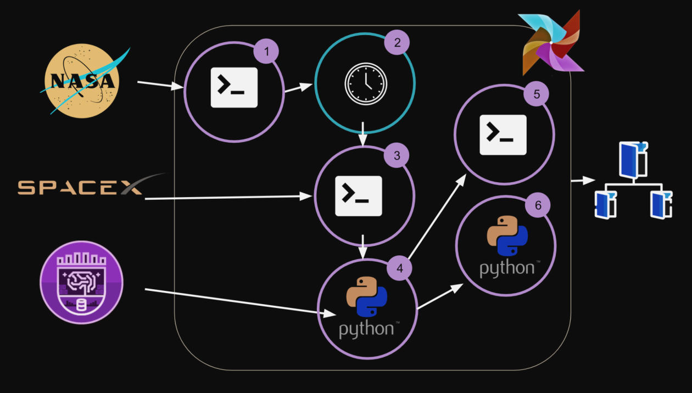

# Airflow Exploración espacial

Proyecto del curso Fundamentos de Apache Airflow en Platzi, creación de un Data Pipeline que provendrá de uno de los satélites de SpaceX.

## Objetivos

Los equipos de analistas y marketing de Platzi necesitan datos de los estudiantes que han accedido al satélite e información del historial de eventos de Spacex, por lo tanto necesitamos ayuda para ejecutar las siguientes tareas:

1. Esperar a que la NASA nos dé autorización para acceder a los datos
del satélite.
2. Recoger datos del satélite y dejarlos en un archivo.
3. Recopile datos de la API de SpaceX y colóquelos en un archivo.
4. Enviar un mensaje a los equipos de que los datos finales son
disponible.

### Flujo de trabajo

### Grafico

## Requerimientos

* Docker
* Python >= 3

## Habilitar modificación de airflow.cfg

Ingresa al archivo docker-compose y dentro de la siguiente sección **volúmenes**, agrega la siguiente línea:

    - ./:/opt/airflow

Con esto al subir nuestro contenedor los archivos de configuración se moverán a la ruta donde esté nuestro proyecto más importante. **airflow.cfg**.

## Configuración de alertas de correo electrónico de Airflow mediante Gmail

Edite el archivo **airflow.cfg** para agregar los detalles del servidor de correo. Es obligatorio crear una contraseña de aplicación de Google para tu cuenta de Gmail, sigue los siguientes pasos:

1. Visite la página Contraseñas de aplicaciones. (https://security.google.com/settings/security/apppasswords)
2. En la parte inferior, haga clic en **Seleccionar aplicación** y elija la aplicación que está utilizando.
3. Haga clic en **Seleccionar dispositivo** y elija el dispositivo que está utilizando.
4. Seleccione Generar.
5. Siga las instrucciones para ingresar la **Contraseña de la aplicación** (el código de 16 caracteres) en su dispositivo.
6. Seleccione Listo.

En airflow.cfg edite la sección [smtp] como se muestra a continuación:

your_email_address = Tu dirección de Gmail.

16_digit_app_password = La contraseña de la aplicación generada arriba.

## Ejecutar el proyecto
    $ docker-compose up

Entra en el sitio web: https://localhost:8081
